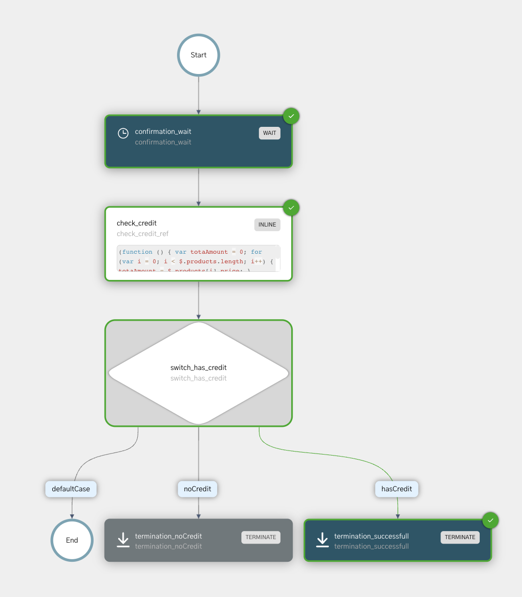

# Example checkout app with Conductor and NextJS

## Prerquisite
1. node >= 18
2. port 3456 open
3. Conductor server

### Setup conductor server (IMPORTANT)
1. To run this app against a server, you need to set the KEY, SECRET and server URL
2. To obtain the KEY and SECRET for the server, visit the applications from the Conductor UI, create a new application and copy the KEY and SECRET.  
3. Make sure to grant full `unrestricted worker` role to the application you create for dev and testing environment. 
4. Export the variables as below
```shell
# set the KEY and SECRET values with the one obtained from the Conductor UI after creating an application
export KEY=
export SECRET=
# replace CONDUCTOR_SERVER with the actual hostname, the URL must end with /api
export SERVER_URL=http://CONDUCTOR_SERVER/api
# Optional checkout workflow name defaults to MyCheckout2
export CHECKOUT_WF_NAME=MyCheckout2

```

## Run the app
### Install dependencies
```shell
yarn
yarn seedWf
```
### Start app in the dev mode
```shell
yarn dev
```

> open http://localhost:3456/ in the browser to use the app


## Under the hood
1. When a user places the order from the UI, a Conductor workflow is started.
2. The UI *artifically* waits for a few seconds, so give an opportunity to `cancel` the order - this might not be the case in production env
3. Once the wait time is over, the workflow is completed unless the user `cancels` the order, in which case the workflow is terminated.

## Workflow definition
See [workflowCreation.mjs](scripts/workflowCreation.mjs) for the workflow creation using the SDK



